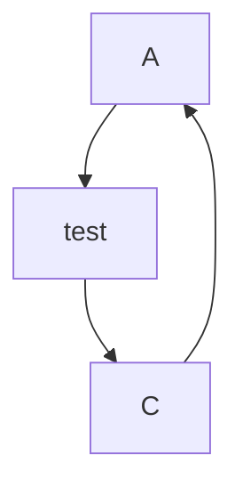

# MermaidをVSCodeで使う場合
## 説明
- MermaidをVSCodeで使う場合の書き方、便利な拡張機能を記載する

## VSCodeでの書き方
- VScodeでMermaidを書く場合は拡張子.mdのファイル内に「```mermaid」から初めて書くことでMermaid記法が認識される
- 例


## 便利な拡張機能
- Markdown Preview Mermaid Support：Mermaid記法をVScodeのプレビューに表示する
- Mermaid Markdown Syntax Highlig：Mermaid記法をハイライト表示する拡張機能
- Markdown PDF：Markdown形式のファイルを**PDF,HTML,jpeg,png**で出力することができる
  - Mermaid記法で書かれた部分は図として出力してみてくれるようだが、MacBook M2Proで試した際は図になっていなかった。
  - [Mermaid Live Editor](https://mermaid.live/)を使えばWebから**PNG,SVG**で出力することは可能。でも、オンライン上に情報をアップロードするので使用には注意が必要

