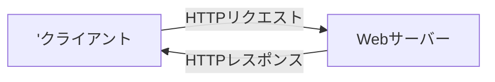

# HTTPリクエストとHTTPレスポンス
## 概要
- 表題の内容について、理解度が不足しているため、知識を整理するためのノート

## HTTP通信の流れ
1. クライアント側のPCでブラウザにURLを入力
2. クライアント側のPCからWebサーバーに`「HTTPリクエスト」`を送信する
3. Webサーバーが`「HTTPレスポンス」`をクライアント側のPCに送信する
4. クライアント側のPCでWebページを表示する

- クライアントは、取得したhtmlファイルをみて、CSSや画像ファイルが必要な場合は再度サーバーにリクエストを送り、取得したhtml、CSS、画像を組み立ててページを表示する。

## HTTPリクエスト
- HTTPリクエストにはGETメソッドとPOSTメソッドが存在する
### GETメソッド
- URLにパラメータ（クエリ文字列）をつけて、Webサーバーにリクエストを送る。
- クエリ文字列はURLの末尾に?がついて、「名前=値」の形式で表す。値が複数の場合は「&」でつなげる
  - 例：`http://127.0.0.1/test?text1=1&text2=b`
- クエリ文字列はブラウザのURL欄に表示される。
- クエリ文字列は大量のデータを送るのに向いていない。
### POSTメソッド
- URLにクエリ文字ついていない。
- POSTメソッドの場合は送信するデータのボディ部分に入力フォームなど画面で入力した内容が入っている
- POSTは大きめのデータを送信できる
- 入力内容はボディにありGETのようにブラウザのURLには表示されない
- ボデイは解析すれば確認できるのでセキュリティ的に安全というわけではない

##　HTTPレスポンス

## 参考サイト
1. [「HTTPリクエスト」と「HTTPレスポンス」](https://itsakura.com/network-http-get-post)
2. [chromeでのHTTPリクエストの確認方法](https://with.sunabaco.com/759)