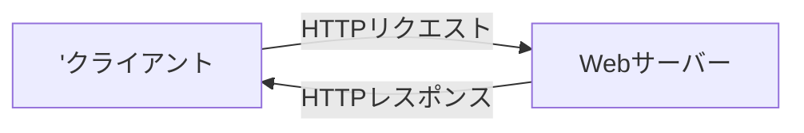

# HTTPリクエストとHTTPレスポンス
## 概要
- 表題の内容について、理解度が不足しているため、知識を整理するためのノート

## HTTP通信の流れ
1. クライアント側のPCでブラウザにURLを入力
2. クライアント側のPCからWebサーバーに`「HTTPリクエスト」`を送信する
3. Webサーバーが`「HTTPレスポンス」`をクライアント側のPCに送信する
4. クライアント側のPCでWebページを表示する

- クライアントは、取得したhtmlファイルをみて、CSSや画像ファイルが必要な場合は再度サーバーにリクエストを送り、取得したhtml、CSS、画像を組み立ててページを表示する。

## HTTPリクエスト
- HTTPリクエストにはGETメソッドとPOSTメソッドが存在する
### GETメソッド
- URLにパラメータ（クエリ文字列）をつけて、Webサーバーにリクエストを送る。
- クエリ文字列はURLの末尾に?がついて、「名前=値」の形式で表す。値が複数の場合は「&」でつなげる
  - 例：`http://127.0.0.1/test?text1=1&text2=b`
- クエリ文字列はブラウザのURL欄に表示される。
- クエリ文字列は大量のデータを送るのに向いていない。
### POSTメソッド
- URLにクエリ文字ついていない。
- POSTメソッドの場合は送信するデータのボディ部分に入力フォームなど画面で入力した内容が入っている
- POSTは大きめのデータを送信できる
- 入力内容はボディにありGETのようにブラウザのURLには表示されない
- ボデイは解析すれば確認できるのでセキュリティ的に安全というわけではない

##　HTTPレスポンス
- サーバーからの応答結果
- 以下の内容で構成されている
1. ステータス行  
   1. HTTPのバージョン
   2. ステータスコード（番号によって応答内容が異なる）
2. ヘッダー
   1. Server：Webサーバーの名前とバージョンなど
   2. Conten-type：出力するMINEタイプ
3. 空白行：ヘッダーとボディを分けている
4. ボディ：HTMLや画像が含まれている。
### HTTPレスポンスの主なステータス番号
|ステータスコード|説明|
|:---:|---|
|200|OK リクエストが成功しレスポンスが返される。正常処理を表す。|
|301|Moved Parmanently 指定したリソースは移動したので、新しい場所から取得して下さい サイトの引越しをしたときは、この値を設定します。|
|302|Moved Temporarily 指定したリソースは一時的に移動したので、新しい場所から取得して下さい。 一時的にサイトの場所を変える時にこの値を設定します。|
|304|Not Modified 指定したファイルは変更されていないのでブラウザのキャッシュのデータ を表示してください。|
|401|Unauthorixed 認証に失敗しました。|
|403|Forbidden アクセス権がありません。|
|404|Not Found リクエストしたアドレスのページがありません。|
|500|Internal Server Error スクリプトなどで内部のエラーが発生しています|
|502|Bad Gateway ゲートウェイが無効なレスポンスを受け取りました。|
|503|Service Unavailable サービスが提供できません。 Webサーバーに負荷がかかりすぎたときなどに表示されます。|
|504|Gateway Timeout 上流からのレスポンスが時間内に得られないときに表示されます。|

## 参考サイト
1. [「HTTPリクエスト」と「HTTPレスポンス」](https://itsakura.com/network-http-get-post)
2. [chromeでのHTTPリクエストの確認方法](https://with.sunabaco.com/759)
3. [MDN Web Docs](https://developer.mozilla.org/ja/)
   1. Referencesから[HTML],[CSS],[JavaScripts],[HTTP],[Web APIs]のドキュメントを閲覧できる。HTTPのステータスコードもここで確認できる。